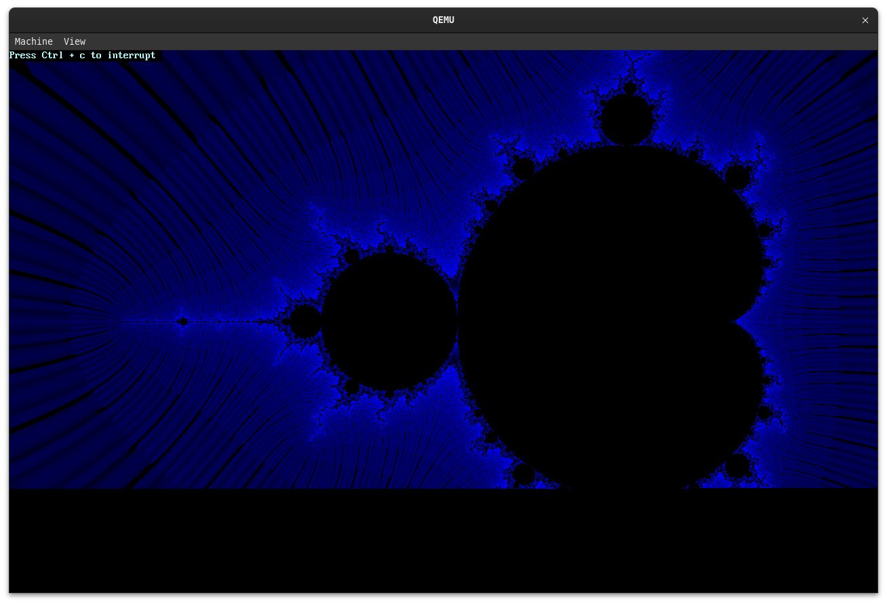
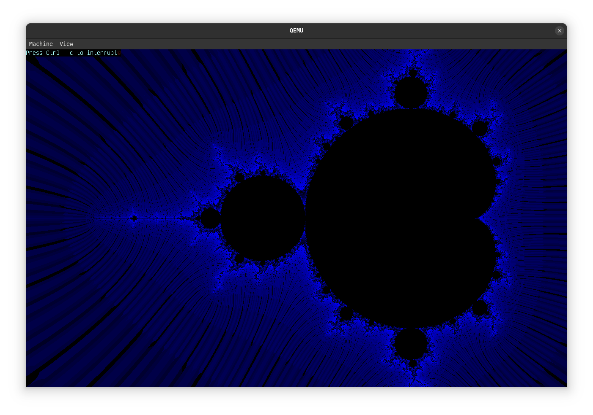

# CaCOS

## Coherent and Cohesive Operating System

(It is absolutely none of these words :D )

### Features ?

 You can edit files (not persistent), type characters do very basic commands and play snake.

## The Plan
    
 Rewrite

============================ => STAGE 0 (bootloader)

 -> custom zig bootloader
    |> load the kernel
    |> pass the framebuffer
    |> pass the memorymap
    |> IDT and GDT ?

============================ => STAGE 1 (core-functionnality)
 
 -> framebuffer
    |> display font
 
 -> memory
    |> page allocation
    |> segfaults
 
 -> interrupts
    |> IDT
    |> GDT

 -> error handling

 -> Process management

 -> Filesystem
    |> rootfs
        * use zig structures for everything
        * create file
        * delete file
        * set data
        * append data
        * change file attributes

 -> Load binaries

============================ => STAGE 2 (drivers and processes)

 -> Keyboard
 -> Console

============================ => STAGE 3 (apps)

 -> Filesystem utils (cd mv rm touch cat pwd ls)
 -> Base commands (echo uname ps...)
 -> ...

### Dependecies

 To run this project you will need zig 13, a linker and Qemu
 
### How to run ?

 Simply run `$ zig build run-iso` to execute
