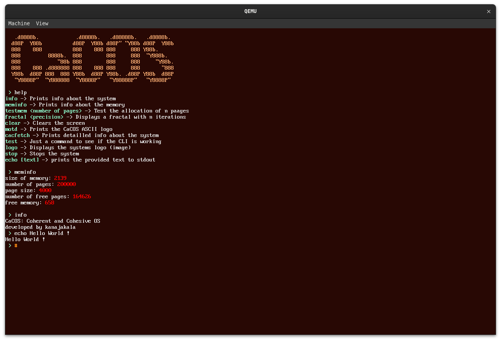

# CaCOS
## Coherent and Cohesive Operating System
(It is absolutely none of these words :D )

### Features ?
 You can do basic memory manipulation, type characters and even delete them
 
### Dependecies
 To run this project you will need zig 13, a linker and Qemu
 
### How to run ?
 Simply run `$ zig build run-iso` to execute
